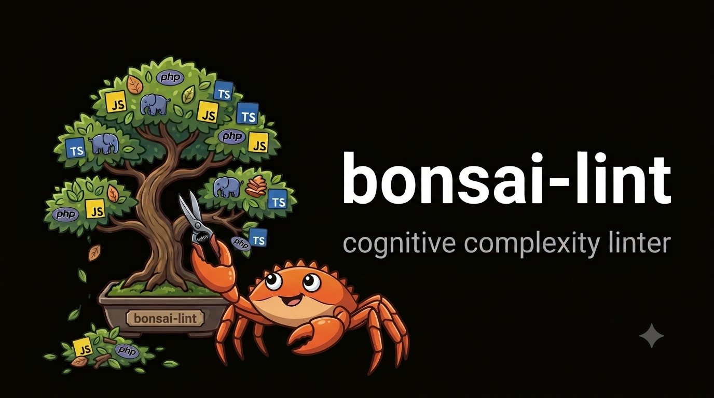
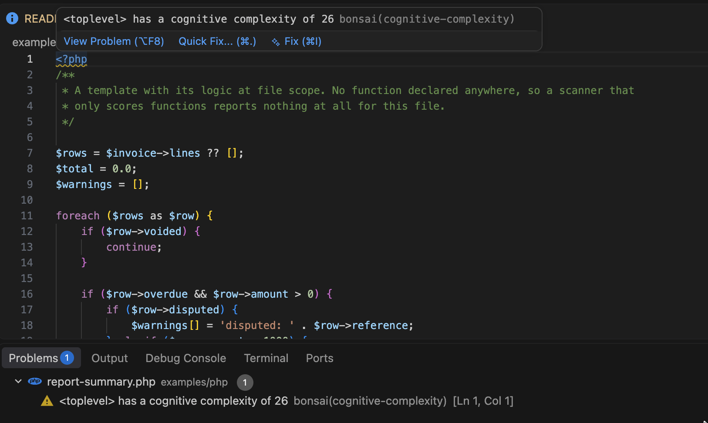
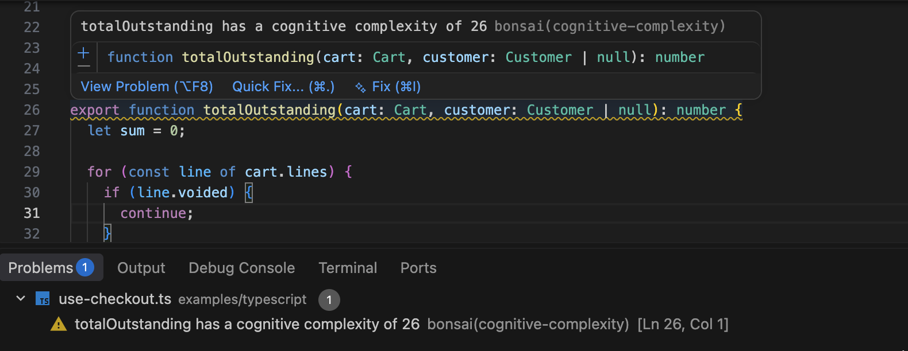

# bonsai-lint



**Find the code that's hard to read, in seconds, in one project or a whole monorepo.**

*Bonsai: the art of keeping a tree small enough to take in at a glance. Same idea, applied to
your syntax trees.*

A cognitive complexity linter written in Rust. One static binary that reads PHP, JavaScript,
TypeScript and Vue single-file components. Use it for any one of them, or all at once. No PHP
runtime, no Node runtime, no Composer entry, nothing added to your project. Scans **1.26 million
lines in 0.8 seconds**.

[](https://github.com/ryckakas/bonsai-lint/actions/workflows/ci.yml)
[](https://www.npmjs.com/package/bonsai-lint)
[](https://deps.rs/repo/github/ryckakas/bonsai-lint)


## Why this one

- **One language, or all of them.** Point it at a PHP project and it is a PHP linter; point it
  at a TypeScript one and it is a TypeScript linter. Nothing to configure either way. Point it at
  both and they score on one metric in one pass, and the same logic written in either language
  gets the same number. That is tested.
- **No runtime, no plugins, no conflicts.** Nothing to wire into a PHPStan or ESLint setup, no
  plugin versions to keep in step, no Composer entry. A 6 MB binary, 1 MB to download, or
  `npx bonsai-lint` and install nothing at all.
- **Never executes your code.** Syntax-only: no autoloader, no reflection, no module
  resolution. Safe to point at third-party or untrusted source.
- **Complexity compounds through callbacks.** A closure inside a loop inside a condition is
  scored at the depth it actually sits at, so a callback pyramid shows up as one hard function
  instead of several innocent-looking ones.
- **Sees the code other tools miss.** Procedural scripts, templates, route files and
  module-level initialisation are scored too, not skipped for living outside a function. On a
  legacy codebase that is often where the worst of it has been hiding.
- **Adoptable on day one.** Baseline your existing violations and gate on regressions, instead
  of being told to fix hundreds of functions before you can turn it on.

Cognitive complexity measures how hard code is to *read*, where cyclomatic complexity measures
how hard it is to *test*. A `switch` with twenty arms is cyclomatically awful and cognitively
fine; three nested `if`s are the reverse. The metric is
[SonarSource's](https://www.sonarsource.com/resources/cognitive-complexity/).

## Install

```bash
npx bonsai-lint --over 15 src/            # run it without installing anything
npm install -D bonsai-lint                # or pin it in the project
brew install ryckakas/tap/bonsai-lint     # macOS and Linux
cargo install bonsai-lint                 # from source
curl -LsSf https://github.com/ryckakas/bonsai-lint/releases/latest/download/bonsai-lint-installer.sh | sh
```

The npm package fetches the prebuilt binary for your platform on install. Nothing is compiled,
and Node only launches it. The analysis itself is pure Rust.

## Use it

```bash
bonsai-lint src/                     # fail on anything above 15
bonsai-lint --over 10 src/           # stricter; `--over php=10,typescript=20` per language
bonsai-lint --all src/               # every unit, ranked
bonsai-lint --format json src/       # for editors and CI
bonsai-lint --write-baseline src/    # record today's findings, exit 0
bonsai-lint --lang php src/          # one language only: `php` or `typescript`
```

<details>
<summary><b>The rest of the flags: monorepos, CI and editors</b></summary>

```bash
bonsai-lint --domain web                       # one declared domain only
bonsai-lint --baseline PATH .                  # one baseline file for the whole repo, wherever you choose
bonsai-lint --config packages/web src/         # discover config from here, not from the first path
bonsai-lint --no-toplevel src/                 # skip code outside any function
bonsai-lint --stdin --stdin-path src/a.php < buffer   # score an unsaved buffer as that file
bonsai-lint --jobs 4 .                         # cap the workers; 0 or absent uses every core
```

</details>

```text
  69  packages/billing/src/invoice-mapper.service.ts:47  InvoiceMapperService::mapLineItems
  25  services/api/src/Controller/CheckoutController.php:207  CheckoutController::applyDiscounts
  22  packages/web/src/parser/lexer.js:19  Lexer
```

<details>
<summary><b>The same run as JSON</b></summary>

```bash
bonsai-lint --format json .
```

```json
{
  "thresholds": {
    "php": 15,
    "typescript": 15
  },
  "breaches": 3,
  "findings": [
    {
      "path": "packages/billing/src/invoice-mapper.service.ts",
      "line": 47,
      "name": "InvoiceMapperService::mapLineItems",
      "score": 69,
      "language": "typescript",
      "domain": "root"
    },
    {
      "path": "services/api/src/Controller/CheckoutController.php",
      "line": 207,
      "name": "CheckoutController::applyDiscounts",
      "score": 25,
      "language": "php",
      "domain": "root"
    },
    {
      "path": "packages/web/src/parser/lexer.js",
      "line": 19,
      "name": "Lexer",
      "score": 22,
      "language": "typescript",
      "domain": "root"
    }
  ]
}
```

`findings` is already ranked, worst first, so a consumer does not have to sort it. `thresholds`
is keyed by language id and reports what the scan actually applied, which is the domain's
threshold rather than the root's when the scan was scoped to one. `breaches` counts the findings
over that threshold, and is what the exit code follows; with `--all` the array also carries
everything under it, and `breaches` still counts only the ones that failed.

`domain` names the domain a file resolved to — `root` when there is no `bonsai-lint.toml`
declaring any — and `path` is always forward-slashed, so a report generated on Windows compares
against one generated in CI.

</details>

A clean run prints nothing and exits 0. Exit 1 means a breach, or that the scan was
untrustworthy, because a path could not be read or matched no supported file. A gate that
cannot read what it was pointed at must not report success.

<details>
<summary><b>Supported languages and extensions</b></summary>

| Extensions | Parsed as | Language id |
| --- | --- | --- |
| `.php`, `.phtml` | PHP | `php` |
| `.ts`, `.mts`, `.cts` | TypeScript | `typescript` |
| `.tsx`, `.jsx`, `.js`, `.mjs`, `.cjs` | TypeScript with JSX | `typescript` |
| `.vue` | the `<script>` blocks only | `vue` |
| `*.d.ts` | skipped, signatures only | |

The language id is what `--lang`, `--over LANG=N` and a `[section]` in the config take, so
`typescript` covers every JavaScript and TypeScript file however it is parsed. An id that is not
one of these is an error, not a silent no-op.

`.js` is parsed with the TypeScript grammar, which accepts a superset of JavaScript. Flow
annotations are the one thing this misparses.

A `.vue` file scores its `<script>` and `<script setup>` blocks, with `lang="ts"` choosing the
TypeScript grammar and anything else (including no `lang`) choosing the JSX-capable one, which
is the grammar `.js` already uses. Each block is parsed on its own, and their file-level code is
added together into the one `<toplevel>` a component reports. Reported lines are lines in the
`.vue` file, so editing a template moves a finding without changing its baseline key.

| Construct | Scored |
| --- | --- |
| `<script>` and `<script setup>`, any `lang` | yes, as `vue` |
| a `render()` function written in a script block | yes, as `vue` |
| JSX inside `<script lang="tsx">` | yes, as `vue` |
| `<template>`: `v-if`, `v-for`, `{{ }}`, `@click="a && b()"` | no |
| `<style>`, and custom blocks such as `<docs>` or `<i18n>` | no |
| `<script src="./logic.ts">` | no, but `logic.ts` is scanned on its own, as `typescript` |

Two consequences are worth knowing:

- **The template is deliberately not scored.** A `v-if` chain is real branching, but the
  specification was not written against templates and counting them would make a component
  incomparable with the same logic written in TypeScript. A `render()` function *is* scored,
  because it is ordinary script code, so moving logic out of a template and into `render()`
  makes it visible, and a component that never had a template was never hidden.
- **A `src=` block belongs to the file it points at.** That file is scored as `typescript`, so a
  `[vue]` threshold does not reach it.

</details>

<details>
<summary><b>The same code scores the same in every language</b></summary>

```php
foreach ($orders as $order) {          //  +1
    if ($order->isActive()) {          //  +2
        array_map(function ($item) {   //  +0, nesting is now 3
            if ($item->qty > 0) {      //  +4
                return $item->qty > 10 ? 'bulk' : 'single';   // +5
```

```text
  12  backend/Orders.php:3   OrderRepository::syncLineItems
  12  frontend/orders.ts:1   syncLineItems
```

Identical logic, identical number. That is what makes one threshold meaningful across a
monorepo.

</details>

## Configure it, or don't

Nothing on disk is required. Defaults are a threshold of 15 for every language, `.gitignore`
respected, top-level code scored. One `bonsai-lint.toml` at the repository root covers a normal
project:

```toml
threshold = 15
exclude   = ["vendor/**", "**/*.generated.ts"]

[typescript]
threshold = 20
```

<details>
<summary><b>Every configuration key</b></summary>

| Key | Default | Meaning |
| --- | --- | --- |
| `threshold` | `15` | Fail above this score. A `[php]` or `[typescript]` section overrides it per language. |
| `exclude` | `[]` | Globs, relative to the config's own directory. `*` stops at `/` and `**` crosses it, as in `.gitignore`. |
| `toplevel` | `true` | Score code outside any function as `<toplevel>`. |
| `baseline` | `.bonsai-lint-baseline.json` | Where this directory's baseline lives, relative to it. |
| `domains` | none | Root config only: globs naming directories that own their own config and baseline. |
| `name` | the directory | A domain's name in output and for `--domain`. |

A misspelt key is an error rather than a silent default, and so is a negated glob: `!pattern`
is not supported.

</details>

<details>
<summary><b>Monorepos: per-team thresholds and baselines</b></summary>

Add `domains` and each team owns its own thresholds and its own baseline, without editing a
shared file. The root declares *where* domains may live, so a stray config cannot quietly
create one.

```toml
# bonsai-lint.toml at the repository root
domains   = ["packages/*", "services/*"]
threshold = 15
```

```toml
# packages/web/bonsai-lint.toml
name      = "web"
threshold = 20
```

```text
packages/web/.bonsai-lint-baseline.json       # each domain keeps its own
services/billing/.bonsai-lint-baseline.json
```

`--write-baseline` then writes one file per domain and prints what it wrote, or says that there
was nothing to record. Baseline keys are relative to the domain root, so they survive being
checked out anywhere, on any platform. A domain's own `exclude` is relative to its root too; the
root's applies everywhere.

`--baseline PATH` keeps every domain in one file of your choosing instead. Its keys are relative
to the repository root, so two domains with a `src/index.ts` cannot collide. Which to use is
your call: one file is simpler for a small repository, while per-domain files stay short and
put each team's accepted debt in the directory that team owns.

Wherever you point the CLI, the workspace is the same one. Discovery walks up from the first
scanned path and takes the outermost `bonsai-lint.toml` that declares `domains` as the root, so
`bonsai-lint packages/web` applies the same root excludes, inherited thresholds and domain list
as `bonsai-lint .`, and so does an editor buffer. Without a `domains` declaration anywhere, the
nearest config is the root. `--config PATH` starts the walk somewhere else.

</details>

<details>
<summary><b>Baselines: adopt it without fixing everything first</b></summary>

```bash
bonsai-lint --write-baseline src/
```

Records everything currently above the threshold as accepted. Later runs fail only on scores
that got worse, or on units the baseline has never seen. An unknown key is treated as a
regression, never as an acceptance. A renamed function is reported rather than silently
inheriting someone else's amnesty. Entries that match nothing are reported too, so a baseline
cannot quietly rot into a permanent exemption, but only by a scan that covered the whole
domain, so a single file from a pre-commit hook or an editor buffer never cries stale.

Without a `bonsai-lint.toml`, the directory holding the baseline is the project root, so
`bonsai-lint --write-baseline .` followed by `bonsai-lint src/Foo.php` finds the same entries.

</details>

<details>
<summary><b>Suppressing a finding: with a reason, or not at all</b></summary>

```php
// bonsai-lint-ignore: hand-tuned state machine, splitting it hurts more than it helps
function parse(string $input): Ast { /* ... */ }
```

Works above the declaration, inside the docblock, or trailing the signature line, in every
supported language, and for a `$handler = function () {}` or `const handler = () => {}` too. A
marker after a closing brace on its own line belongs to nobody. **A marker without a reason is
refused**, reported on stderr, and the finding stands. Suppression hides a finding but never
changes a score, and `--all` always shows the real number.

A `<toplevel>` finding is reported on line 1, so its marker goes in the comment block at the top
of the file: trailing `<?php`, in the file's docblock, or on the first line of a script, behind a
shebang if there is one. One comment silences one unit, so a marker directly above the first
function is that function's; write it on the `<?php` line to address the file instead.

</details>

## Scoring

Three rules from the [specification](https://www.sonarsource.com/resources/cognitive-complexity/):
shorthand that doesn't break reading flow is free; **+1** for each break in linear flow;
**+nesting** when a flow-breaker sits inside other flow-breakers. Full table in
[docs/scoring-rules.md](docs/scoring-rules.md).

<details>
<summary><b>Code outside a function is still code</b></summary>

Most complexity tools only score functions and methods, so a 200-line procedural template, a
route table or a module-level bootstrap is invisible to them. bonsai-lint scores whatever is left
over as a `<toplevel>` unit, one per file:

```text
  84  services/api/templates/report/summary.php:1  <toplevel>
  37  services/api/scripts/migrate-tenants.php:1  <toplevel>
```



Files with no top-level logic report nothing, so this costs you no noise. Turn it off with
`--no-toplevel` or `toplevel = false`.

</details>

<details>
<summary><b>How it differs from eslint-plugin-sonarjs</b></summary>

Numbers from bonsai-lint will not always match `eslint-plugin-sonarjs`. Every difference is a
deliberate choice, and this is all of them, so you can judge which suits you:

| | `eslint-plugin-sonarjs` | bonsai-lint |
| --- | --- | --- |
| Closure inside a function | scored separately, from zero | carries the nesting it sits at |
| `??`, `a?.b` | +1 | free |
| JSX `{cond && <X/>}` | exempt | +1, the same as the equivalent ternary |
| `const x = a \|\| []` | exempt | +1 |
| Code outside any function | not scored | scored as `<toplevel>` |

The first row moves numbers the most. Scoring every function from zero means a pyramid of
callbacks costs almost nothing:

```js
if (a) { for (const x of xs) { xs.forEach(item => { if (b) { … } }); } }
```

bonsai-lint reports that as a single unit scoring **7**. Scored per function it is two units, at 3
and 1. Neither is wrong. They answer different questions. Per-function tells you how hard each
piece is on its own; bonsai-lint tells you how hard the whole thing is to read where it stands. If
you care about callback depth, the second is the more useful number.

Migrating? Expect your numbers to move, mostly upward, for these reasons and no others.

</details>

## Editor



The [VS Code extension](editors/vscode) reports diagnostics for all five language IDs. It
analyses the buffer as you type, not the file on disk, and it deliberately does **not** pass a
threshold unless you set one, so the editor shows exactly what CI would fail on, your
`bonsai-lint.toml` and baselines included.

## Performance

| Corpus | Time |
| --- | --- |
| 1.26 million lines of PHP, JavaScript and TypeScript | **0.77s** |

Roughly **1.6 million lines per second**, across three languages, in one pass, on a ten-core
M5. No warm-up, no daemon, no language server. One process, start to finish.

Files are read, parsed and scored in parallel; `--jobs` bounds that, and `--jobs 1` is the same
scan on one core, at 3.15s. The report is byte for byte identical either way — findings are
collected and ranked after the scan, never printed as they arrive — so a diff of two runs is
always a real change, not a scheduling artefact.

One binary, 6.3 MB on disk and about 1 MB to download, with every language built in. There is
no variant to choose and nothing to enable.

## Documentation

- [Scoring rules](docs/scoring-rules.md): the full increment table and per-language notes
- [Architecture](docs/architecture.md): the language seam, and how to add a language
- [Roadmap](ROADMAP.md): what is likely to come next, and why
- [Changelog](CHANGELOG.md): what changed in each release

## License

MIT
