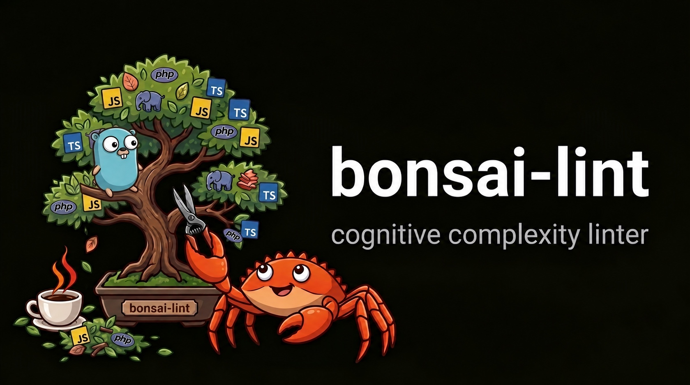

# bonsai-lint



**Find the code that's hard to read, in seconds, in one project or a whole monorepo.**

*Bonsai: the art of keeping a tree small enough to take in at a glance. Same idea, applied to
your syntax trees.*

A multi-language cognitive complexity linter written in Rust. One static binary that currently
reads JavaScript, TypeScript, Vue single-file components, Python, Java, PHP and Go. Use it for any
one of them, or all at once. No runtime or toolchain for any of them, nothing added to your project.
Scans **1.26 million lines in 0.8 seconds**.

The official site is **[bonsai.kauneckas.dev](https://bonsai.kauneckas.dev)**: install and editor
guides, and a [playground](https://bonsai.kauneckas.dev/play/) that scores code in your browser.

[](https://github.com/ryckakas/bonsai-lint/actions/workflows/ci.yml)
[](https://www.npmjs.com/package/bonsai-lint)
[](https://deps.rs/repo/github/ryckakas/bonsai-lint)


## Why this one

- **One language or all of them.** Point it at any project with nothing to configure. A mixed
  codebase scores in one pass on one metric, and the same logic gets the same number in every
  language. That is tested.
- **No runtime, no plugins, no conflicts.** Nothing to wire into each language's own linter and
  no plugin versions to keep in step.
- **Never executes your code.** Syntax only: no autoloader, reflection or module resolution, so
  untrusted source is safe to scan.
- **Callbacks compound.** A closure in a loop in a condition scores at its real depth, so a
  callback pyramid is one hard function, not several easy ones.
- **Sees the code other tools miss.** Scripts, templates, route files and module-level setup are
  scored too. On a legacy codebase that is often where the worst of it hides.
- **Adoptable on day one.** Baseline existing findings and fail only on regressions.

Cognitive complexity measures how hard code is to *read*, where cyclomatic complexity measures
how hard it is to *test*. A `switch` with twenty arms is cyclomatically awful and cognitively
fine; three nested `if`s are the reverse.

## Install

```bash
npx bonsai-lint --over 15 src/            # run it without installing anything
npm install -D bonsai-lint                # or pin it in the project
brew install ryckakas/tap/bonsai-lint     # macOS and Linux
go install bonsai.kauneckas.dev/bonsai-lint@latest
cargo install bonsai-lint                 # from source
curl -LsSf https://github.com/ryckakas/bonsai-lint/releases/latest/download/bonsai-lint-installer.sh | sh
```

The npm package fetches the prebuilt binary for your platform on install. Nothing is compiled,
and Node only launches it. The analysis itself is pure Rust.

Linux has two builds. One links glibc 2.35 or newer. The other is static and runs on any Linux,
which covers Alpine and other musl systems as well as older glibc. The installer script, the npm
package and the Go module each pick the right one for you.

In a Go module, `go get -tool bonsai.kauneckas.dev/bonsai-lint@latest` pins it in `go.mod`, and
`go tool bonsai-lint` runs it (Go 1.24+). The Go module is a launcher with no dependencies, at the
same version as the CLI. The first run of each version downloads that release's binary, checks it
against a checksum recorded in the module, and caches it. The platforms and settings are in
[bonsai-lint-go](https://github.com/ryckakas/bonsai-lint-go).

There is no PyPI package, pre-commit hook, or Maven or Gradle plugin yet. On a Python or Java
project, use Homebrew, the installer script or `npx bonsai-lint`.

## Use it

```bash
bonsai-lint src/                     # fail on anything above 15
bonsai-lint --over 10 src/           # stricter; `--over php=10,typescript=20` per language
bonsai-lint --all src/               # every unit, ranked
bonsai-lint --format json src/       # for editors and CI
bonsai-lint --write-baseline src/    # record today's findings, exit 0
bonsai-lint --lang php src/          # one language only; `--help` lists the ids
```

<details>
<summary><b>The rest of the flags: monorepos, CI and editors</b></summary>

```bash
bonsai-lint --domain web                       # one declared domain only
bonsai-lint --baseline PATH .                  # one baseline file for the whole repo, wherever you choose
bonsai-lint --config packages/web src/         # discover config from here, not from the first path
bonsai-lint --no-toplevel src/                 # skip code outside any function
bonsai-lint --stdin --stdin-path src/a.php < buffer   # score an unsaved buffer as that file
bonsai-lint --jobs 4 .                         # cap the workers; 0 or absent uses every core
```

</details>

```text
  69  packages/billing/src/invoice-mapper.service.ts:47  InvoiceMapperService::mapLineItems
  25  services/api/src/Controller/CheckoutController.php:207  CheckoutController::applyDiscounts
  22  packages/web/src/parser/lexer.js:19  Lexer
```

<details>
<summary><b>The same run as JSON</b></summary>

```bash
bonsai-lint --format json .
```

```json
{
  "thresholds": {
    "go": 15,
    "java": 15,
    "php": 15,
    "python": 15,
    "typescript": 15,
    "vue": 15
  },
  "breaches": 3,
  "findings": [
    {
      "path": "packages/billing/src/invoice-mapper.service.ts",
      "line": 47,
      "name": "InvoiceMapperService::mapLineItems",
      "score": 69,
      "language": "typescript",
      "domain": "root"
    },
    {
      "path": "services/api/src/Controller/CheckoutController.php",
      "line": 207,
      "name": "CheckoutController::applyDiscounts",
      "score": 25,
      "language": "php",
      "domain": "root"
    },
    {
      "path": "packages/web/src/parser/lexer.js",
      "line": 19,
      "name": "Lexer",
      "score": 22,
      "language": "typescript",
      "domain": "root"
    }
  ]
}
```

`findings` is already ranked, worst first, so a consumer does not have to sort it. `thresholds`
is keyed by language id and reports what the scan actually applied, which is the domain's
threshold rather than the root's when the scan was scoped to one. `breaches` counts the findings
over that threshold, and is what the exit code follows; with `--all` the array also carries
everything under it, and `breaches` still counts only the ones that failed.

`domain` names the domain a file resolved to — `root` when there is no `bonsai-lint.toml`
declaring any — and `path` is always forward-slashed, so a report generated on Windows compares
against one generated in CI.

</details>

A clean run prints nothing and exits 0. Exit 1 means a breach, or that the scan was
untrustworthy, because a path could not be read or matched no supported file. A gate that
cannot read what it was pointed at must not report success.

<details>
<summary><b>Supported languages and extensions</b></summary>

| Extensions | Parsed as | Language id |
| --- | --- | --- |
| `.js`, `.mjs`, `.cjs`, `.jsx`, `.tsx` | TypeScript with JSX | `typescript` |
| `.ts`, `.mts`, `.cts` | TypeScript | `typescript` |
| `.vue` | the `<script>` blocks only | `vue` |
| `.py`, `.pyw` | Python | `python` |
| `.java` | Java | `java` |
| `.php`, `.phtml` | PHP | `php` |
| `.go` | Go | `go` |
| `*.min.js`, `*.min.mjs`, `*.min.cjs` | skipped, generated output | |
| `*.d.ts`, `*.d.mts`, `*.d.cts` | skipped, signatures only | |
| `.pyi` | not scanned, typing stubs | |
| `.py` whose header says "generated" and "do not edit" | skipped, generated output | |
| `.java` whose header says "generated" and "do not edit" | skipped, generated output | |
| `.go` headed `// Code generated … DO NOT EDIT.` | skipped, generated output | |

The language id is what `--lang`, `--over LANG=N` and a `[section]` in the config take, so
`typescript` covers every JavaScript and TypeScript file however it is parsed. An id that is not
one of these is an error, not a silent no-op.

`.js` is parsed with the TypeScript grammar, which accepts a superset of JavaScript. Flow
annotations are the one thing this misparses.

A declaration file and a minified one are both skipped outright, for opposite reasons: the first
holds only signatures so every unit scores zero, and the second is generated output whose whole
body rolls up into one unit nobody will refactor. The skipped names are whole suffixes, listed by
the TypeScript and TSX descriptors' `unscored_suffixes`, so `app.mini.js`, `jasmine.js` and a
file simply called `min.js` are all still scanned.

A `.vue` file scores its `<script>` and `<script setup>` blocks, with `lang="ts"` choosing the
TypeScript grammar and anything else (including no `lang`) choosing the JSX-capable one, which
is the grammar `.js` already uses. Each block is parsed on its own, and their file-level code is
added together into the one `<toplevel>` a component reports. Reported lines are lines in the
`.vue` file, so editing a template moves a finding without changing its baseline key.

| Construct | Scored |
| --- | --- |
| `<script>` and `<script setup>`, any `lang` | yes, as `vue` |
| a `render()` function written in a script block | yes, as `vue` |
| JSX inside `<script lang="tsx">` | yes, as `vue` |
| `<template>`: `v-if`, `v-for`, `{{ }}`, `@click="a && b()"` | no |
| `<style>`, and custom blocks such as `<docs>` or `<i18n>` | no |
| `<script src="./logic.ts">` | no, but `logic.ts` is scanned on its own, as `typescript` |

Two consequences are worth knowing:

- **The template is deliberately not scored.** A `v-if` chain is real branching, but the
  the metric is defined over script code, and counting a template would make a component
  incomparable with the same logic written in TypeScript. A `render()` function *is* scored,
  because it is ordinary script code, so moving logic out of a template and into `render()`
  makes it visible, and a component that never had a template was never hidden.
- **A `src=` block belongs to the file it points at.** That file is scored as `typescript`, so a
  `[vue]` threshold does not reach it.

A Python method is keyed by its class, `OrderService::process`. A property's getter, setter and
deleter redefine one name on purpose, so the accessor a decorator declares joins the key:
`Cart::total`, `Cart::total.setter` and `Cart::total.deleter` are baselined apart. A def whose
body is only `...`, such as an `@overload` stub or a protocol method, declares a signature and is
not a unit. A `.py` file is skipped as generated by the same header rule as Java below, which
covers protobuf, gRPC and Thrift output. A Django migration says only "Generated by Django",
because it is meant to be edited, so it stays scored.

Java overloads freely, so a Java method or constructor is keyed by its parameter types as well as
its name: `OrderService::process(Order, User)`. Each type is its simple name, without type
arguments or annotations, so two overloads are baselined apart and switching between an import
and a qualified name never re-keys one. Java has no single generated-code convention, so a `.java`
file is skipped when the comments before its first line of code say both "generated" and "do not
edit". That covers protobuf, Thrift, Avro and JavaCC output. Most generated sources sit in a
gitignored `target/` or `build/` directory and are never scanned in the first place.

Go marks generated code in the file rather than its name, so a `.go` file is read first and then
turned away if a `// Code generated … DO NOT EDIT.` line comes before its `package` clause, which
is the convention the Go toolchain itself follows. Such a file is neither scored nor counted, on
disk and through `--stdin` alike. `vendor/` and `testdata/` get no special treatment: if a
repository commits them, `exclude = ["vendor/**", "**/testdata/**"]` keeps them out.

A Go method is keyed by its receiver type, so `func (s *Stack[T]) Push()` reports as
`Stack::Push` and keeps its baseline entry when the receiver switches between pointer and value.

</details>

<details>
<summary><b>The same code scores the same in every language</b></summary>

```php
foreach ($orders as $order) {          //  +1
    if ($order->isActive()) {          //  +2
        array_map(function ($item) {   //  +0, nesting is now 3
            if ($item->qty > 0) {      //  +4
                return $item->qty > 10 ? 'bulk' : 'single';   // +5
```

```text
  12  backend/Orders.php:3   OrderRepository::syncLineItems
  12  frontend/orders.ts:1   syncLineItems
```

Identical logic, identical number. That is what makes one threshold meaningful across a
monorepo.

</details>

## Configure it, or don't

Nothing on disk is required. Defaults are a threshold of 15 for every language, `.gitignore`
respected, top-level code scored. One `bonsai-lint.toml` at the repository root covers a normal
project:

```toml
threshold = 15
exclude   = ["vendor/**", "**/*.generated.ts"]

[typescript]
threshold = 20
```

<details>
<summary><b>Every configuration key</b></summary>

| Key | Default | Meaning |
| --- | --- | --- |
| `threshold` | `15` | Fail above this score. A section named after a language id, such as `[typescript]`, overrides it per language. |
| `exclude` | `[]` | Globs, relative to the config's own directory. `*` stops at `/` and `**` crosses it, as in `.gitignore`. |
| `toplevel` | `true` | Score code outside any function as `<toplevel>`. |
| `baseline` | `.bonsai-lint-baseline.json` | Where this directory's baseline lives, relative to it. |
| `domains` | none | Root config only: globs naming directories that own their own config and baseline. |
| `name` | its path from the root, such as `packages/web` | A domain's name in output and for `--domain`. Two domains cannot share one. |

A misspelt key is an error rather than a silent default, named with a suggestion when one is
close, and so is a negated glob: `!pattern` is not supported.

</details>

<details>
<summary><b>Monorepos: per-team thresholds and baselines</b></summary>

Add `domains` and each team owns its own thresholds and its own baseline, without editing a
shared file. The root declares *where* domains may live, so a stray config cannot quietly
create one.

```toml
# bonsai-lint.toml at the repository root
domains   = ["packages/*", "services/*"]
threshold = 15
```

```toml
# packages/web/bonsai-lint.toml
name      = "web"
threshold = 20
```

```text
packages/web/.bonsai-lint-baseline.json       # each domain keeps its own
services/billing/.bonsai-lint-baseline.json
```

`--write-baseline` then writes one file per domain and prints what it wrote, or says that there
was nothing to record. Baseline keys are relative to the domain root, so they survive being
checked out anywhere, on any platform. A domain's own `exclude` is relative to its root too; the
root's applies everywhere.

`--baseline PATH` keeps every domain in one file of your choosing instead. Its keys are relative
to the repository root, so two domains with a `src/index.ts` cannot collide. Which to use is
your call: one file is simpler for a small repository, while per-domain files stay short and
put each team's accepted debt in the directory that team owns.

Wherever you point the CLI, the workspace is the same one. Discovery walks up from the first
scanned path and takes the outermost `bonsai-lint.toml` that declares `domains` as the root, so
`bonsai-lint packages/web` applies the same root excludes, inherited thresholds and domain list
as `bonsai-lint .`, and so does an editor buffer. Without a `domains` declaration anywhere, the
nearest config is the root. `--config PATH` starts the walk somewhere else.

</details>

<details>
<summary><b>Baselines: adopt it without fixing everything first</b></summary>

```bash
bonsai-lint --write-baseline src/
```

Records everything currently above the threshold as accepted. Later runs fail only on scores
that got worse, or on units the baseline has never seen. An unknown key is treated as a
regression, never as an acceptance. A renamed function is reported rather than silently
inheriting someone else's amnesty. Two units in one file that share a key, such as a def
redefined under `if`/`else`, share one entry holding the higher score. Entries that match
nothing are reported too, so a baseline cannot quietly rot into a permanent exemption, but only
by a scan that covered the whole domain, so a single file from a pre-commit hook or an editor
buffer never cries stale.

Without a `bonsai-lint.toml`, the directory holding the baseline is the project root, so
`bonsai-lint --write-baseline .` followed by `bonsai-lint src/Foo.php` finds the same entries.

</details>

<details>
<summary><b>Suppressing a finding: with a reason, or not at all</b></summary>

```php
// bonsai-lint-ignore: hand-tuned state machine, splitting it hurts more than it helps
function parse(string $input): Ast { /* ... */ }
```

Works above the declaration, inside the docblock, or trailing the signature line, in every
supported language. In Python it goes in a `#` comment above the `def` or its decorators: a
docstring is a string inside the body, not a comment, so it cannot carry a marker. It works for a
bound function too, such as `const handler = () => {}`, Python's `handler = lambda e: …`, a
Java field `Runnable handler = () -> {}`, `$handler = function () {}` or Go's
`var handler = func() {}`, even when a call wraps it, as in
`const useCart = defineStore('cart', () => {})`. A marker after a closing brace on its own line
belongs to nobody. **A marker without a reason is refused**, reported on stderr, and the finding
stands. Suppression hides a finding but never changes a score, and `--all` always shows the real
number.

A `<toplevel>` finding is reported on line 1, so its marker goes in the comment block at the top of
the file: on the first line of a script, behind a shebang if there is one; in Python, behind a
shebang or coding line and above the module docstring; just above or trailing the `package` line
in Java or Go; or trailing `<?php`, or in the file's docblock, in PHP. One
comment silences one unit, so a marker directly above the first function is that function's; write
it on the `package` or `<?php` line to address the file instead.

</details>

## Scoring

Three rules: shorthand that doesn't break reading flow is free; **+1** for each break in linear
flow; **+nesting** when a flow-breaker sits inside other flow-breakers. Full table in
[docs/scoring-rules.md](docs/scoring-rules.md).

<details>
<summary><b>Code outside a function is still code</b></summary>

Most complexity tools only score functions and methods, so a 200-line procedural template, a
route table or a module-level bootstrap is invisible to them. bonsai-lint scores whatever is left
over as a `<toplevel>` unit, one per file:

```text
  84  services/api/templates/report/summary.php:1  <toplevel>
  37  services/api/scripts/migrate-tenants.php:1  <toplevel>
```


Files with no top-level logic report nothing, so this costs you no noise. Turn it off with
`--no-toplevel` or `toplevel = false`.

</details>

<details>
<summary><b>Choices that move the numbers</b></summary>

Numbers from bonsai-lint will not always match another implementation. Every difference is a
deliberate choice, and this is all of them, so you can judge which suits you:

| | Elsewhere | bonsai-lint |
| --- | --- | --- |
| Closure inside a function | scored separately, from zero | carries the nesting it sits at |
| `??`, `a?.b` | +1 | free |
| JSX `{cond && <X/>}` | exempt | +1, the same as the equivalent ternary |
| `const x = a \|\| []` | exempt | +1 |
| Code outside any function | not scored | scored as `<toplevel>` |
| An `if` inside a plain `else` block | no deeper than the `else` | one level deeper, like any branch body |
| `a && (b \|\| c) && d` | 2, the group counted as its own run | 3, grouping is transparent |
| `a && b \|\| c && d` | 2, each operator counted once | 3, each switch of operator starts a run |
| A later link of an `else if` chain | one level deeper per link | one level below its `if`, like the first |
| A loop or `switch` header | one level deeper | at the construct's own depth |
| A method calling itself through its receiver | not recursion | +1 |
| A builtin sharing a method's name, `append()` inside `append` | +1, as recursion | free |
| A Python comprehension, `[x for x in xs if x]` | each `for` and `if` clause +1, or ignored | free, but nests like the callback chain it replaces |
| A Python loop's or `try`'s `else:` | free | +1, like any `else` |
| A Python `match` | free | +1, like a `switch` |
| `f(key=a or b)`, `(x or "") + y`, `f"{a and b}"` | not counted | +1, wherever the operator sits |
| A function holding only a nested function and its `return` | the inner one keeps its level | one level deeper, like any closure |
| A nested function under an `if` or `with`, or a method of a local class | no deeper than the code around it | one level deeper, like any closure |
| A bare `m()` inside Python method `m` | +1, as recursion | free: the name is a global |
| A Python function recursing twice | +1 once, and not through `self` | +1 per call, through `self`, `cls` or its class |
| A local closure sharing its function's name | resolved to the local | +1 per call, matched by name |
| A Java overload taking as many arguments | resolved by type, not recursion | +1, matched by name and argument count |
| A call through another instance of the same type, `left.count()` | +1, as recursion | free |

The last three rows are limits rather than preferences: recursion is recognised by syntax alone,
with no scope or type analysis.

The first row moves numbers the most. Scoring every function from zero means a pyramid of
callbacks costs almost nothing:

```js
if (a) { for (const x of xs) { xs.forEach(item => { if (b) { … } }); } }
```

bonsai-lint reports that as a single unit scoring **7**. Scored per function it is two units, at 3
and 1. Neither is wrong. They answer different questions. Per-function tells you how hard each
piece is on its own; bonsai-lint tells you how hard the whole thing is to read where it stands. If
you care about callback depth, the second is the more useful number.

Migrating? Expect your numbers to move, mostly upward, for these reasons and no others.

</details>

## Editor


The [VS Code extension](editors/vscode) reports diagnostics for every editor language it is
configured for. It
analyses the buffer as you type, not the file on disk, and it deliberately does **not** pass a
threshold unless you set one, so the editor shows exactly what CI would fail on, your
`bonsai-lint.toml` and baselines included.

## Performance

| Corpus | Time |
| --- | --- |
| 1.26 million lines of JavaScript, TypeScript and PHP | **0.77s** |
| 1.51 million lines of Python, CPython's standard library and Django | **0.92s** |
| 2.29 million lines of Java, Spring Framework and Guava | **1.08s** |
| 2.85 million lines of Go, its own standard library | **0.79s** |

That is roughly **1.6 million lines per second** on the monorepo, three languages in one pass,
**1.6 million** on Python, **2.1 million** on Java and **3.6 million** on the Go standard library,
all on a ten-core M5. No
warm-up, no daemon, no language server. One process, start to finish.

Files are read, parsed and scored in parallel; `--jobs` bounds that, and `--jobs 1` is the same
scan on one core, at 3.15s. The report is byte for byte identical either way — findings are
collected and ranked after the scan, never printed as they arrive — so a diff of two runs is
always a real change, not a scheduling artefact.

One binary, about 2 MB to download and about 8 MB on disk, with every language built in. There
is no variant to choose and nothing to enable.

## Documentation

- [bonsai.kauneckas.dev](https://bonsai.kauneckas.dev): the official site, with guides and a
  playground
- [Scoring rules](docs/scoring-rules.md): the full increment table and per-language notes
- [Architecture](docs/architecture.md): the language seam, and how to add a language
- [Roadmap](ROADMAP.md): what is likely to come next, and why
- [Changelog](CHANGELOG.md): what changed in each release

## License

MIT
